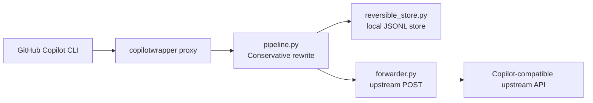

# copilotwrapper 🚀

> A clean-room, local-first wrapper to reduce GitHub Copilot CLI token usage **before** requests reach the upstream LLM.

copilotwrapper adds a conservative compression layer in front of Copilot-compatible OpenAI endpoints.  
It prioritizes safety and correctness: only tool-style large JSON payloads are rewritten; normal user prose stays untouched.

## ✨ Highlights

| Capability | Status | Notes |
|---|---|---|
| Local reverse proxy for Copilot traffic | ✅ | Handles `POST /v1/chat/completions` and `POST /v1/responses` |
| Conservative pre-LLM compression | ✅ | Targets tool-style large JSON content |
| Reversible handles for rewritten segments | ✅ | Originals stored locally and linked via `reversible_handle` |
| `compress` utility command | ✅ | Reads messages JSON from stdin and returns compression result JSON |
| Clean-room implementation policy | ✅ | See `docs/CLEAN_ROOM_SPEC.md` |

## 🧠 Why this exists

When coding agents send large tool outputs, token usage can spike quickly.  
copilotwrapper intercepts request payloads, compresses only eligible segments, and forwards optimized requests upstream.

## 🏗️ Architecture (current)



### Core modules

- `copilotwrapper/proxy.py` → HTTP server, endpoint validation, structured errors
- `copilotwrapper/pipeline.py` → content-aware conservative rewrite logic
- `copilotwrapper/reversible_store.py` → local handle→original payload store
- `copilotwrapper/forwarder.py` → sanitized upstream request forwarding
- `copilotwrapper/config.py` → env/CLI config loading and validation
- `copilotwrapper/cli.py` → `compress` and `proxy` commands

## ⚡ Quickstart

### 1) Install

```bash
pip install -e .
```

### 2) Start proxy

Option A: environment variable

```bash
export COPILOTWRAPPER_UPSTREAM_BASE_URL=https://api.githubcopilot.com
python -m copilotwrapper proxy
```

Option B: CLI flag

```bash
python -m copilotwrapper proxy --upstream-base-url https://api.githubcopilot.com
```

### 3) Route Copilot CLI through proxy

```bash
export COPILOT_PROVIDER_API_URL=http://127.0.0.1:8787
```

## 🔧 CLI usage

### `compress`

Compresses JSON messages from stdin:

```bash
cat messages.json | python -m copilotwrapper compress
```

### `proxy`

Starts the local proxy server:

```bash
python -m copilotwrapper proxy [--listen-host 127.0.0.1] [--listen-port 8787] [--upstream-base-url ...]
```

## 🧪 Configuration

| Variable | Required | Default | Description |
|---|---|---|---|
| `COPILOTWRAPPER_UPSTREAM_BASE_URL` | Yes* | — | Upstream base URL (`http://` or `https://`) |
| `COPILOTWRAPPER_LISTEN_HOST` | No | `127.0.0.1` | Proxy bind host |
| `COPILOTWRAPPER_LISTEN_PORT` | No | `8787` | Proxy bind port |
| `COPILOTWRAPPER_MIN_TOKENS` | No | `250` | Minimum token threshold before compression |
| `COPILOTWRAPPER_STORE_PATH` | No | `.copilotwrapper-store.jsonl` | Reversible store file path |
| `COPILOTWRAPPER_TIMEOUT_SECONDS` | No | `30` | Upstream timeout |
| `COPILOTWRAPPER_MAX_BODY_BYTES` | No | `10485760` (10 MiB) | Max accepted request body size |

\*Not required when `--upstream-base-url` is provided.

## 🛡️ Security and clean-room policy

- ✅ Original, clean-room implementation (no copied proprietary code)
- ✅ Upstream scheme validation at startup
- ✅ Path-only endpoint forwarding guard
- ✅ Hop-by-hop header filtering
- ✅ Structured error responses with trace IDs

See:
- `docs/CLEAN_ROOM_SPEC.md`
- `CONTRIBUTING.md`

## ⚠️ Current limitations

- **Chunked request bodies are not supported** (`Transfer-Encoding: chunked` → `501`).
- **`Content-Length` is required** (missing → `411`).
- **Oversized requests are rejected** (`413`) when declared size exceeds limit.
- **Streaming responses are buffered** end-to-end before client delivery.
- **Reversible store is plaintext and unbounded** unless you rotate/manage it.
- **`/v1/responses` is passthrough-only** in conservative mode today.

## 🧬 Repository structure

```text
copilotwrapper/
├── copilotwrapper/
│   ├── __init__.py
│   ├── __main__.py
│   ├── cli.py
│   ├── compress.py
│   ├── config.py
│   ├── forwarder.py
│   ├── pipeline.py
│   ├── proxy.py
│   └── reversible_store.py
├── docs/
│   ├── CLEAN_ROOM_SPEC.md
│   └── superpowers/
├── tests/
├── CONTRIBUTING.md
├── LICENSE
├── pyproject.toml
└── README.md
```

## ✅ Development and tests

Run tests:

```bash
PYTHONPATH=. python -m pytest -q
```

## 📜 License

This project is licensed under the **MIT License**.  
See `LICENSE` for full text.
