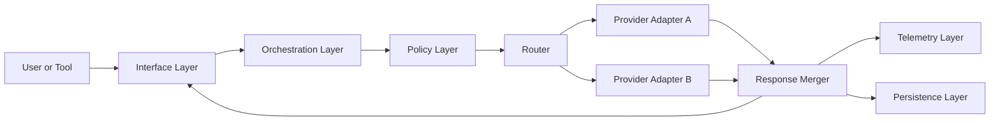

# copilotwrapper Clean-Room Architecture Specification

## 1. Purpose and Scope

copilotwrapper is an open-source wrapper platform for AI coding assistant workflows. It provides a neutral middleware layer that accepts user requests, applies policy and context processing, routes calls to configured providers, and returns traceable responses.

This repository is designed as a fresh implementation inspired by broad category behavior only. It does not copy source code, naming, file structure, algorithm internals, or proprietary design patterns from any existing project.

### Goals
- Build a provider-agnostic wrapper runtime for coding-assistant requests.
- Support safe policy enforcement, request shaping, and observability.
- Keep architecture modular so components can be audited and replaced independently.
- Enable reproducible local development and community contribution.

### Non-Goals
- Reimplementing any external project internals verbatim.
- Replicating hidden heuristics or architecture from closed or protected sources.
- Shipping embedded proprietary SDK logic without explicit permissive licensing.

## 2. Clean-Room Development Policy

All implementation work must comply with a clean-room process.

### Mandatory Rules
- Authors must write all code from scratch.
- No copy-paste from third-party repositories, docs examples beyond trivial syntax, or generated derivatives of protected code.
- Variable names, function names, class names, and module layouts must be authored uniquely for this project.
- Internal logic and control flow must be independently designed and documented.
- Any contributor referencing external material must limit usage to high-level behavior descriptions and public standards.

### Process Controls
- Keep an architecture decision record (ADR) for each major behavior.
- For each feature, require a short "independent design note" explaining original reasoning.
- Enforce contributor attestation in pull requests:
  - "I certify this code is an original implementation under clean-room rules."
- Run license scanning in CI to block non-permissive dependencies.

## 3. License and Dependency Compliance

### Project License
- Primary repository license: MIT.
- Documentation and examples: MIT unless explicitly stated otherwise.

### Approved Dependency Licenses
- MIT
- Apache-2.0
- BSD-2-Clause
- BSD-3-Clause
- ISC

### Restricted or Disallowed by Default
- GPL family (GPL, AGPL, LGPL) for runtime-linked core dependencies unless governance explicitly approves and architecture isolates obligations.
- Custom licenses with field-of-use restrictions.
- Dependencies without clear SPDX identifiers.

### Compliance Pipeline Requirements
- Add automated Software Bill of Materials (SBOM) generation.
- Add license-policy checks in CI (fail build on non-approved licenses).
- Track dependency provenance and versions in lockfiles.
- Maintain a THIRD_PARTY_NOTICES.md for attribution where required.

## 4. High-Level System Architecture

copilotwrapper follows a layered, component-isolated architecture.

1. Interface Layer
- Exposes CLI and HTTP API entry points.
- Normalizes user input into internal request envelopes.

2. Orchestration Layer
- Coordinates request lifecycle.
- Applies policies, context transforms, provider routing, retries, and response shaping.

3. Policy Layer
- Enforces redaction rules, size/token thresholds, allow/deny controls, and audit flags.

4. Provider Adapter Layer
- Implements a strict adapter contract for each upstream AI provider.
- Keeps provider-specific formatting isolated from core logic.

5. Telemetry Layer
- Emits structured logs, metrics, and traces for each request phase.

6. Persistence Layer
- Stores optional request metadata, run summaries, and cache artifacts.



## 5. Core Component Definitions

### 5.1 Request Envelope
Responsibility:
- Encapsulate user prompt, metadata, execution hints, and policy context.

Contract:
- Immutable once accepted by orchestration.
- Contains correlation ID for tracing.

### 5.2 Policy Engine
Responsibility:
- Evaluate ordered policy rules.
- Produce actions: allow, transform, warn, or reject.

Contract:
- Deterministic outputs for identical inputs.
- Ruleset version recorded in telemetry.

### 5.3 Context Processor
Responsibility:
- Trim, prioritize, and enrich context payloads.
- Apply safe redaction before external dispatch.

Contract:
- Outputs bounded by configurable token and size limits.

### 5.4 Provider Router
Responsibility:
- Select target adapter via explicit strategy.

Candidate strategies:
- Static provider
- Weighted provider fallback
- Capability-based provider selection

### 5.5 Adapter Interface
Responsibility:
- Translate internal envelopes to provider-specific requests.
- Normalize provider responses to canonical output format.

Contract fields:
- send(requestEnvelope) -> providerResult
- health() -> status
- metadata() -> capabilities

### 5.6 Observability Service
Responsibility:
- Aggregate lifecycle events and outcomes.
- Emit standardized event schema for logs and metrics.

## 6. Repository Structure (Proposed)

```text
copilotwrapper/
  docs/
    CLEAN_ROOM_SPEC.md
    ADR/
  src/
    interface/
    orchestration/
    policy/
    adapters/
    telemetry/
    persistence/
    shared/
  tests/
    unit/
    integration/
    compliance/
  tools/
    ci/
    scripts/
  .github/
    workflows/
  LICENSE
  README.md
  CONTRIBUTING.md
  THIRD_PARTY_NOTICES.md
  SECURITY.md
```

## 7. API and Interface Specification

### HTTP API (v1)
- POST /v1/execute
  - Accepts normalized request envelope.
  - Returns response payload, route metadata, and trace ID.
- GET /v1/health
  - Returns runtime and adapter health.
- GET /v1/policies
  - Returns active policy summary and version.

### CLI
- copilotwrapper run --prompt "..." --provider auto
- copilotwrapper health
- copilotwrapper policies show

Design principles:
- No provider-specific flags in core commands unless namespaced.
- Stable JSON output mode for automation.

## 8. Data Model Overview

### Primary Entities
- RequestRecord
  - id, timestamp, caller, policyVersion, routeDecision
- ResponseRecord
  - requestId, provider, latencyMs, outputDigest, status
- PolicyDecision
  - requestId, ruleId, action, rationale

### Storage Policy
- Default local storage for development.
- Pluggable persistence backend for production deployments.
- PII-sensitive fields must support configurable masking at write time.

## 9. Security and Privacy Requirements

- Enforce secrets never logged in plaintext.
- Add configurable prompt and output redaction rules.
- Use least-privilege tokens for provider access.
- Sign release artifacts and publish checksums.
- Add dependency and container vulnerability scans in CI.

## 10. Testing and Quality Gates

### Test Pyramid
- Unit tests: policy rules, routing logic, adapters.
- Integration tests: end-to-end request lifecycle with mock providers.
- Compliance tests: license checks, clean-room attestation checks, dependency policies.

### Required CI Gates
- Lint and formatting
- Unit and integration tests
- License-policy check
- SBOM generation
- Security scan

## 11. Documentation Standards

Required docs:
- README.md: quick start, architecture summary, compatibility.
- CONTRIBUTING.md: coding standards, clean-room policy, DCO/attestation.
- SECURITY.md: vulnerability disclosure process.
- ADR directory: one ADR per major architectural choice.

## 12. Governance and Contribution Policy

- Require pull request template with:
  - Problem statement
  - Independent design rationale
  - Test evidence
  - Clean-room attestation
- Require at least one maintainer approval.
- Reject contributions containing copied code or suspicious structural mirroring.

## 13. Milestone Roadmap

### Milestone 1: Foundation
- Initialize repo scaffolding.
- Implement request envelope, policy engine skeleton, and single adapter contract.
- Add CI for tests and license checks.

### Milestone 2: Core Runtime
- Implement orchestration pipeline and provider router.
- Add telemetry schema and local persistence.
- Add CLI and HTTP API MVP.

### Milestone 3: Hardening
- Add multi-provider fallback strategies.
- Add redaction and advanced policy packs.
- Add full compliance reports (SBOM + notices).

### Milestone 4: Community Readiness
- Publish governance docs and contribution workflows.
- Add extensibility guides for new adapters and policies.

## 14. Explicit Originality Statement

This specification mandates that all future implementation in copilotwrapper must be original and independently authored. Contributors must avoid verbatim reuse, near-copy structural cloning, and derivative logic reconstruction from existing protected works.

Only public concepts, open standards, and permissively licensed dependencies may inform the design. The resulting source code must remain a unique implementation created specifically for copilotwrapper.
